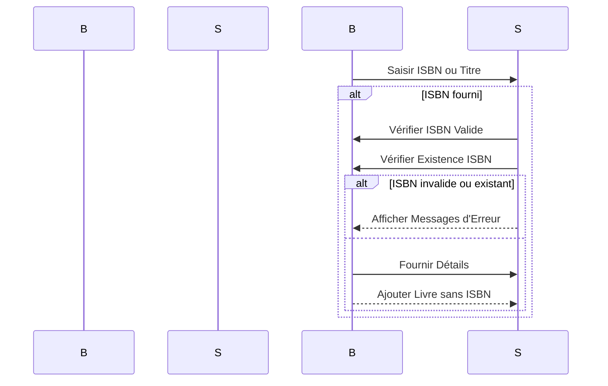

# Proposition de Modification du Système de Gestion de Livres dans la Bibliothèque

## Modification de la Base de Données (MongoDB)

- Ajout d'un champ supplémentaire dans la collection des livres pour stocker le titre comme identifiant unique lorsque l'ISBN n'est pas disponible.
- L'ajout de cette flexibilité permettra de gérer efficacement les livres publiés avant 1972 qui n'ont pas d'ISBN.

## Frontend (Vue.js)

- Modification de l'interface utilisateur pour inclure un champ de saisie du titre en plus de celui de l'ISBN lors de l'ajout d'un livre.
- L'interface utilisateur doit rester intuitive, guidant l'utilisateur à entrer les informations nécessaires en fonction du scénario (ISBN ou titre).

## Backend (Express.js)

- Modification des routes et des contrôleurs pour gérer les deux scénarios : ajout de livre avec ISBN et ajout de livre sans ISBN.
- Implémentation d'une logique de vérification pour s'assurer que l'ISBN est valide, s'il est fourni, et que le titre est unique s'il est utilisé comme identifiant.
- Gestion appropriée des erreurs, avec des messages clairs pour guider l'utilisateur en cas de problème.

## Validation de l'ISBN

- Utilisation d'une bibliothèque de validation d'ISBN pour garantir que les ISBN fournis sont conformes aux normes.
- Affichage d'un message d'erreur si l'ISBN n'est pas valide, incitant l'utilisateur à vérifier et à corriger les informations.

##Tests et Documentation

- Mise en place de tests unitaires et d'intégration pour garantir le bon fonctionnement du système.
- Mise à jour de la documentation pour inclure les nouvelles fonctionnalités et les changements apportés au système.

### Avantages de la Proposition

- **Flexibilité :** Permet d'ajouter des livres sans ISBN, ce qui est crucial pour les livres publiés avant 1972.
- **Intuitivité :** L'interface utilisateur reste conviviale, guidant les utilisateurs tout au long du processus.
- **Sécurité des Données :** La base de données est modifiée pour assurer la cohérence et la sécurité des données.

### Prochaines Étapes

Après approbation de cette proposition, nous pouvons procéder à une phase de développement itérative, en implémentant les changements par étapes et en effectuant des tests approfondis à chaque étape pour garantir la stabilité du système. La communication avec les bibliothécaires tout au long du processus est cruciale pour recueillir des retours d'expérience et garantir que les besoins spécifiques de la bibliothèque sont pleinement satisfaits.

